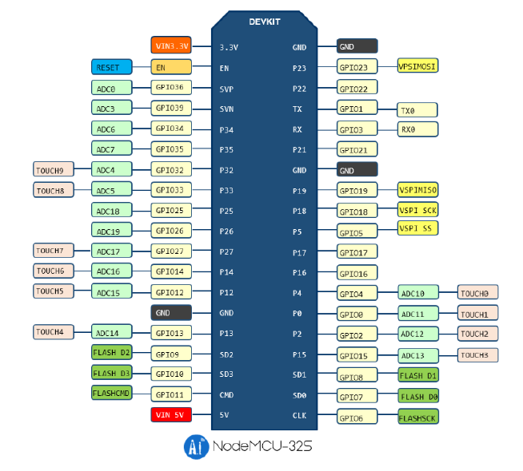
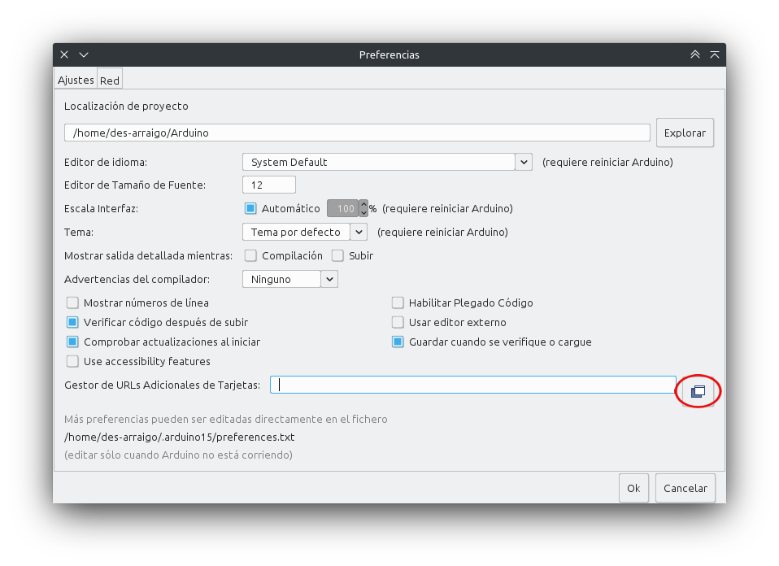
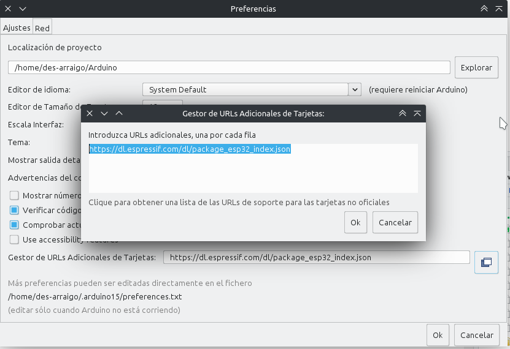
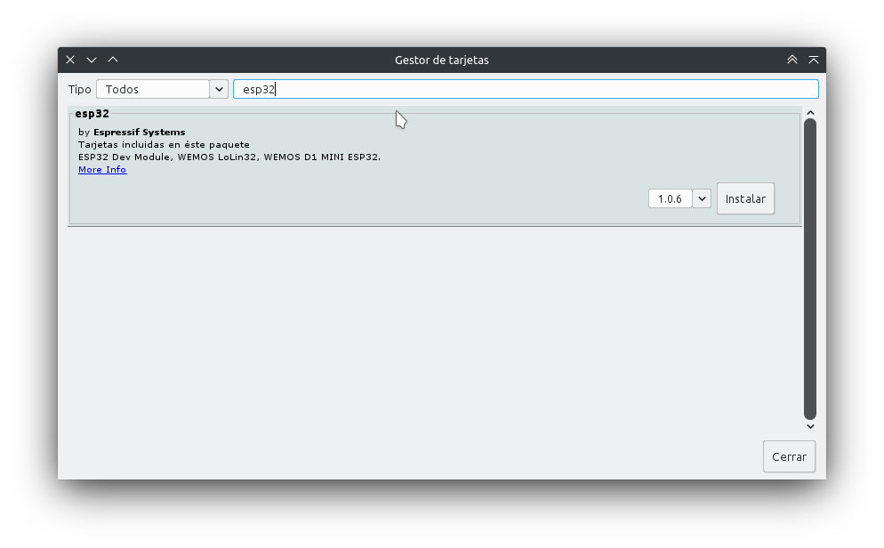

## Introducción

Arduino es una placa bastante versátil en cuanto a sus capacidades, pero es de todos conocido que la versión básica UNO no cuenta con conectividad WiFi ni Bluetooth de forma nativa. Esto nos obliga a adquirir hardware adicional que nos permita expandir la placa. Entre una de las opciones tradicionalmente más utilizadas para paliar esta carencia se encuentra el Sistema Embebido (Sistema en un Chip o System on a Chip, SoC) ESP8266, el cual ha sido desarrollado por Espressif Systems, organización de origen chino. Sin embargo, esta misma organización ya ha desarrollado a la placa sucesora, llamada ESP32 que integra lo siguiente: 

- Wi-Fi (Banda de 2.4 GHz - 802.11 b/g/n)

- Bluetooth 4.2 BR/EDR y de baja energía (BLE)

- CPU Dual Core Tensilica Xtensa LX6 de 32-bit y hasta 240 MHz

- Co-procesador de Ultra Baja Energía

- 448 KiB ROM

- 512 KiB SRAM

Entre las conexiones y protocolos soportados, ESP32 cuenta con

- 38 pines de conexión, incluyendo los pines para alimentación de energía de 5 y 3.3v, además de la tierra

- Conversor analógico-digital y digital-analógico

- I2C

- UART

- CAN 2.0

- SPI

- I2S

- RMII

- Ethernet

- PWM, entre otros.

En cuanto a la seguridad, se soporta:

- Estándares IEEE 802.11, incluyendo WFA, WPA/WPA2 and WAPI

- Arranque seguro

- Encriptación Flash

- Criptografía por aceleración de hardware: AES, SHA-2, RSA, ECC, generador real de números aleatorios (RNG).

Aún se puede seguir enumerando más características, pero estas son las más llamativas. En cuanto a los componentes físicos necesarios para poder trabajar con ESP32 se encuentra obviamente la propia placa, una computadora ejecutando Windows, Linux o MacOS y un cable micro-USB. Y en cuanto al software, se cuenta con varias alternativas: 

- __Toolchain__ para compilar el código

- Herramientas como CMake y Ninja para construir las apps

- __ESP-IDF__ que contiene la API para la ESP32 y scripts para operar la toolchain

Se puede optar por utilizar los plugins para los IDE Eclipse o VS Code, incluso se puede preferir irse por la IDE de Arduino, para programar con los mismos comandos o el add-on PlatformIO que está disponible tanto para VS Code como Atom. Cabe mencionar que utilizaremos estas últimas opciones para reutilizar algunos sketches realizados con Arduino.

## Diagrama de ESP32

Antes de comenzar a manipular la placa ESP32, debemos conocer su cableado. Cuenta con 38 pines, de los cuales tres son tierra, uno es para alimentarla con 3.3v y otro para alimentarle con 5v. De todos modos, se recomienda utilizar el puerto micro-USB para proveerle de energía. El siguiente diagrama es para el módulo NodeMCU-32S, visto de manera que el puerto micro-USB quede hacia abajo. Este módulo es bastante común y es muy probable que sea el primero que se consiga.

Es posible utilizar todos los pines cuyo nombre comienza con GPIO, aunque cabe mencionar que no todos cuentan con el conversor analógico-digital. Puede observarse un pin llamado __EN__, el cual permite entrar en modo _run_, es decir, ejecutar el programa cargado. Es posible descargar la hoja técnica para este módulo en el siguiente  [enlace](https://www.electrosoftcloud.com/wp-content/uploads/2021/04/esp32-wroom-32_datasheet_en.pdf). Si se cuenta con otro módulo, puede buscarse su hoja técnica en la página del fabricante o probablemente encontrarla en la siguiente [página](https://www.espressif.com/en/support/documents/technical-documents).

## Instalación

Como se mencionó anteriormente, utilizaremos lo que ya sabemos de arduino para trabajar con ESP32. Para ello usaremos la IDE de arduino, aunque de momento la tarjeta no se encuentra en los repositorios oficiales, así que debemos instalar uno de manera manual. Con la IDE abierta nos vamos al menú `Archivo -> Preferencias`. Al abrirse esta ventana nueva, en la pestaña `Ajustes` nos dirigimos a la parte inferior y buscamos la caja de texto al lado de `Gestor de URLs adicionales de Tarjetas`. 

Damos clic en el botón indicado en la imagen y se abrirá otra ventana más. Ahí pegamos la siguiente dirección: https://dl.espressif.com/dl/package_esp32_index.json y damos clic en OK.

Nos dirigimos ahora al menú `Herramientas -> Placa: -> Gestor de Tarjetas`, apareciendo una ventana donde buscaremos en la caja de texto «esp32». Aparecerá nuestro dispositivo y damos clic en el botón de instalar:

Ahora toca seleccionar nuestra placa. Conectamos la ESP32 por medio del cable usb - micro-usb a nuestra computadora y debería ser reconocida al instante. En el menú `Herramientas -> Placa: -> ESP32 Arduino` buscamos nuestro modelo de placa. Si tenemos la NodeMCU-32S sí aparecerá tal cual. En caso de contar con otro modelo, basta con utilizar la opción genérica «ESP32 Dev Module». Enseguida seleccionamos el puerto COM donde se encuentra nuestra ESP32 y ya estamos en condiciones de subir nuestro _sketch_. Cabe mencionar que el caso del módulo NodeMCU-32S debe dejarse presionado el botón _BOOT_ mientras se carga un _sketch_.

